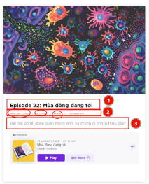

## 0. Background Need
The need for an assistant arises, when a person 
1. has a long todo list, but not enough time
2. wants to record their thoughts from one medium to another

## 1. Process
1. Receive task
	1. Create a #Tracking_issue and add it to the  #Project_board
		1. Notify the Requester in an appropriate communication channel (ie. instance messaging service)
	2. Estimate how much time you will spend on the task
	3. **Await the task being triaged by Requester**
	4. Provide quick action plan, or choose a #guideline from #Knowledge_base
	5. All tasks are to be done inside #Documents
	6. When there are too many tasks follow the Issue #Priority
2. Do the task
	1. Update the #Tracking_issue in the #Project_board
	2. #tip_initial_reflection
	3. #tip_extra_sections
3. Deliver result ^da1fe6
	1. Notify task giver of results
	2. Update the #Project_board
4. Optional
	1. Upload results to the #Knowledge_base

## 2. Kind of tasks
#guideline
### 2.1 Research a topic
^581c31

1. Focus on the website of the topic (else jump to point (3.))
   1. Find 3 interesting #Sub-pages
      1. #tip_navigation_menu
   2. Extract information from the #Sub-pages
      1. List/Cards/Table
       - If there is repeating information, then make sure to follow through the pagination or "load more" button
     - #tip_8020_repeated_information
     - #tip_javascript_in_browser_for_scraping
   3. Navigate through the rest of the website to find potentially other interesting #Sub-pages and follow step (2.)
2. Follow links through other websites
   1. #tip_extra_sections
3. Search the internet for hits related to that topic and go back to point (1.)

Related external links
https://thinkingispower.com/how-to-do-your-own-research/

### 2.2 Fact check
1. Restate the fact(s), that should be checked
2. Research the fact
	1. You can follow [[Assistant Working Guidelines#^581c31]]
	2. In this task, providing sources is important!
3. Complete the fact checking as you would "Deliver results" [[Assistant Working Guidelines#^da1fe6]]

### 2.3 Acknowledging guidelines
1. When there are new or updated guidelines out, eg. in the form of Pull requests to the #Knowledge_base , then please approve the Pull request, to acknowledge the changes.
	1. You are expected to incorporate the updated points in your workflow
	2. Ideally, all updated points are incorporated. Else, slowly over-time is fine

## 3. Examples

### 3.1 Examples for Background Need
1. long todo list
	1. Due to priority reasons, when researching a topic, there is not enough not time to go too deep into the subject, or other interesting topics emerged from the initial research, eg: 
		1. I research topic A, but going deeper takes more time then available
		2. I research topic A, but topic B emerges as also interesting, so I want to check out topic B too
2. Record thoughts
	1. I message and discuss topics with friends on instant messaging platforms a lot. The information generated there is often times interesting, thus I want to record it in a knowledge base, eg:
		1. I give advice on Telegram, and would like this advice to be transferred to Github

### 3.2 Examples for Tasks
#### 3.2.1 Research Example
I'll will provide an example via https://oddly-podcast.com

1. Focus on the main website (https://oddly-podcast.com)
  1. Find 3 #Sub-pages
    - 
  2. Extract information from the #Sub-pages
    - 
    - Title
    - Metadata (createdAt, author, category)
    - Description
  3. Navigate through the rest of the website
    - https://oddly-podcast.com/store
2. Follow links through other websites
   - https://oddly-podcast.com/ung-ho-donate
   - kofi page to see how big their supporter base is

#### 3.2.2 Fact check
- [ ] todo

## Tags
- #guidelines
